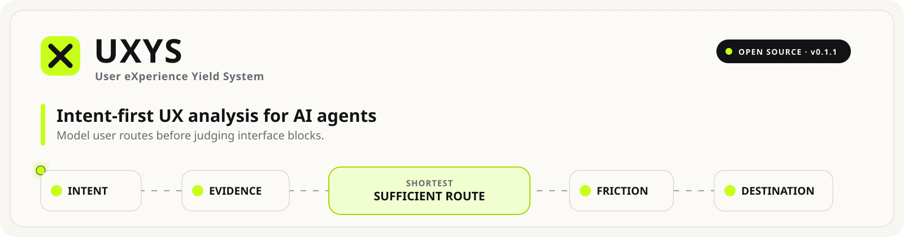

<p align="center">
  
</p>

<p align="center">
  <strong>Intent-first UX analysis for AI agents.</strong><br/>
  Model interfaces as networks of short, sufficient user routes — not generic UX checklists.
</p>

<p align="center">
  <a href="VERSION"></a>
  <a href="https://github.com/Muredsa/UXYS/actions/workflows/validate.yml"></a>
  <a href="LICENSE"></a>
  <a href="SKILL.md"></a>
</p>

<p align="center">
  <a href="README.md"><strong>English</strong></a> ·
  <a href="README.ru.md">Русский</a> ·
  <a href="README.zh-CN.md">简体中文</a>
</p>

<p align="center">
  <a href="https://www.claudemarket.ai/skills"></a>
</p>

---

## What UXYS changes

Most AI UX reviews drift toward familiar advice: make the CTA stronger, reduce clutter, improve hierarchy, add trust, simplify navigation.

UXYS changes the *analysis model* itself.

```text
INTENT
  ↓
EVIDENCE
  ↓
SHORTEST SUFFICIENT ROUTE
  ↓
FRICTION
  ↓
DESTINATION
```

A page is not treated as one ideal funnel for one imaginary visitor. Different visitors may need different amounts of evidence before they can act. A block can therefore be necessary for one intent, useful for another, and distracting for a third.

The goal is not “remove everything unnecessary.” The goal is to make the page a **network of short, sufficient routes that interfere with each other as little as possible**.

## What the skill does

When UXYS is active, the agent should:

- infer several plausible visitor intents without inventing their prevalence;
- define a destination for each intent;
- derive the minimum *semantically sufficient* route before judging the page;
- map actual page blocks to those routes;
- distinguish necessary evidence, supporting evidence, optional content, diversions, harmful friction, destinations, and missing evidence;
- separate **attention**, **semantic**, and **action** transitions;
- evaluate each block across *all* intents before recommending removal;
- reason counterfactually about moving, weakening, strengthening, merging, hiding, or removing a block;
- return simple block-level decisions such as **KEEP / EMPHASIZE / ADJUST / DE-EMPHASIZE / MOVE / REMOVE / ADD**;
- ground conclusions in visible or inspectable evidence and never claim eye-tracking or observed behavior without observed data.

The full procedure lives in [`SKILL.md`](SKILL.md). Supporting rules are kept in [`references/`](references/).

## Install in Codex

Codex discovers skills from a skill directory containing a `SKILL.md`. Clone the whole repository into your Codex skills directory.

### macOS / Linux

```bash
git clone https://github.com/Muredsa/UXYS.git ~/.codex/skills/uxys
```

### Windows PowerShell

```powershell
git clone https://github.com/Muredsa/UXYS.git "$env:USERPROFILE\.codex\skills\uxys"
```

Restart or reopen Codex after installation if the skill does not appear immediately.

> Clone the directory itself rather than symlinking only `SKILL.md`. Codex skill discovery has historically treated file symlinks differently across versions.

## Update the installed skill

Because the skill is installed as a Git repository, updating it is intentionally boring:

### macOS / Linux

```bash
git -C ~/.codex/skills/uxys pull --ff-only
```

### Windows PowerShell

```powershell
git -C "$env:USERPROFILE\.codex\skills\uxys" pull --ff-only
```

See [`CHANGELOG.md`](CHANGELOG.md) before updating across significant versions.

## Versioning

UXYS follows [Semantic Versioning](https://semver.org/):

- **PATCH** — clarifications and fixes that preserve the method;
- **MINOR** — new analysis capabilities or output contracts that remain backward-compatible;
- **MAJOR** — changes to the core reasoning model or incompatible skill behavior.

While UXYS is `0.x`, the method is considered experimental and may evolve quickly. The canonical current version is stored in [`VERSION`](VERSION).

## Tool-aware, not tool-dependent

UXYS is a reasoning method first. It becomes stronger when the host agent has tools:

- **browser** — inspect desktop/mobile states, scroll, interact, and capture the live page;
- **screenshots / vision** — judge visual hierarchy and attention competition;
- **DOM / source code** — verify interactivity, structure, labels, and implementation details;
- **image editing** — create counterfactual visual variants before implementation;
- **code editing** — apply an accepted redesign and verify it in the browser;
- **analytics** — compare predicted routes with observed behavior when real data is explicitly available.

The skill must degrade gracefully when some of these tools are absent.

## Why this is not eye-tracking

UXYS produces **predicted** UX reasoning. It must not turn model confidence into fake behavioral statistics. Without measured analytics or study data, it may say that an element is *likely to compete for attention*; it may not say that “73% of users will look here.”

## Repository map

```text
UXYS/
├── SKILL.md                       # Codex/agent entrypoint
├── references/
│   ├── core-method.md             # Definitions, phases, invariants
│   ├── block-utility.md           # Cross-intent utility & interference
│   ├── tool-workflows.md          # Browser, vision, image/code workflows
│   ├── counterfactual.md          # Redesign simulation protocol
│   └── output-contract.md         # Human-facing result format
├── evals/
│   └── cases.md                   # Regression cases for the method
├── scripts/
│   └── validate_skill.py          # Zero-dependency repository validator
├── README.md                      # English
├── README.ru.md                   # Russian
├── README.zh-CN.md                # Simplified Chinese
├── VERSION
└── CHANGELOG.md
```

## Languages

- [English](README.md)
- [Русский](README.ru.md)
- [简体中文](README.zh-CN.md)

`SKILL.md` and `references/` are canonical and maintained in English so that one executable methodology does not drift across translations. The agent must return the analysis in the user's language unless asked otherwise.

## Contributing

Method changes are welcome, but UXYS is intentionally opinionated. A change should make the reasoning more reliable, more explainable, or less likely to produce generic UX advice — not merely add more checklist items.

Read [`CONTRIBUTING.md`](CONTRIBUTING.md). Changes to the core method should include or update an eval case.

## Scope

UXYS can be applied to landing pages, SaaS interfaces, e-commerce pages, dashboards, onboarding, checkout, forms, content pages, and other visual interaction flows. Page-type specifics may change the intents and evidence, but not the core method.

## License

MIT — see [`LICENSE`](LICENSE).

---

**Keywords:** UX, UX analysis, UX audit, user journey, intent modeling, interaction design, conversion, LLM, AI agent, Codex, prompt engineering, vision, web design, HCI, counterfactual UX, design critique.
