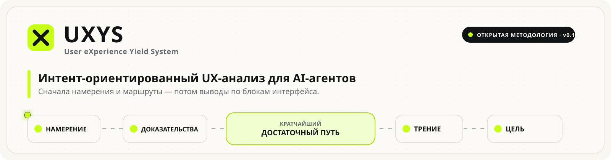

<p align="center">
  
</p>

<p align="center">
  <strong>Intent-first UX-анализ для AI-агентов.</strong><br/>
  Анализируйте интерфейс как сеть коротких достаточных маршрутов, а не как набор шаблонных UX-советов.
</p>

<p align="center">
  <a href="VERSION"></a>
  <a href="https://github.com/Muredsa/UXYS/actions/workflows/validate.yml"></a>
  <a href="LICENSE"></a>
  <a href="SKILL.md"></a>
</p>

<p align="center">
  <a href="README.md">English</a> ·
  <a href="README.ru.md"><strong>Русский</strong></a> ·
  <a href="README.zh-CN.md">简体中文</a>
</p>

<p align="center">
  <a href="https://www.claudemarket.ai/skills"></a>
</p>

---

## Что меняет UXYS

Обычный AI-аудит UX часто сводится к знакомому набору: сделать CTA заметнее, сократить шум, улучшить иерархию, добавить доверие, упростить навигацию.

UXYS меняет не список советов, а **сам способ анализа**.

```text
INTENT
  ↓
EVIDENCE
  ↓
SHORTEST SUFFICIENT ROUTE
  ↓
FRICTION
  ↓
DESTINATION
```

Страница не рассматривается как одна воронка для одного выдуманного «идеального пользователя». Разным посетителям нужен разный объём доказательств перед действием. Поэтому один и тот же блок может быть необходим одному сценарию, полезен второму и отвлекать третьего.

Цель — не «удалить всё лишнее». Цель — сделать страницу **сетью коротких, но достаточных маршрутов, которые как можно меньше мешают друг другу**.

## Что делает скилл

При активном UXYS агент должен:

- определить несколько правдоподобных пользовательских intents, не придумывая их доли;
- назначить destination каждому intent;
- сначала вывести минимально достаточный смысловой маршрут, и только потом судить текущий дизайн;
- сопоставить реальные блоки страницы с маршрутами;
- различать necessary/supporting/optional/diversion/harmful/destination/missing;
- не смешивать переход внимания, смысловой переход и реальное действие;
- оценивать полезность блока **по всем** важным маршрутам до рекомендации удалить его;
- моделировать последствия удаления, перемещения, усиления, ослабления или объединения блока;
- выдавать простой итог по блокам: **KEEP / EMPHASIZE / ADJUST / DE-EMPHASIZE / MOVE / REMOVE / ADD**;
- всегда отделять predicted behavior от реальных наблюдаемых данных и никогда не выдавать модель за eye-tracking.

Полный исполняемый метод находится в [`SKILL.md`](SKILL.md), а уточняющие правила — в [`references/`](references/).

## Установка в Codex

Клонируйте весь репозиторий в каталог скиллов Codex.

### Windows PowerShell

```powershell
git clone https://github.com/Muredsa/UXYS.git "$env:USERPROFILE\.codex\skills\uxys"
```

### macOS / Linux

```bash
git clone https://github.com/Muredsa/UXYS.git ~/.codex/skills/uxys
```

Если скилл не появился сразу, перезапустите или заново откройте Codex.

## Обновление

Поскольку скилл установлен обычным Git-репозиторием, обновление выполняется через `pull`.

### Windows PowerShell

```powershell
git -C "$env:USERPROFILE\.codex\skills\uxys" pull --ff-only
```

### macOS / Linux

```bash
git -C ~/.codex/skills/uxys pull --ff-only
```

Перед значительными обновлениями смотрите [`CHANGELOG.md`](CHANGELOG.md).

## Версионность

UXYS использует Semantic Versioning:

- **PATCH** — исправления и уточнения без изменения сути метода;
- **MINOR** — новые совместимые возможности анализа;
- **MAJOR** — несовместимые изменения основной модели мышления.

Пока версия `0.x`, метод считается экспериментальным и может быстро развиваться. Текущая версия хранится в [`VERSION`](VERSION).

## Инструменты усиливают метод, но не определяют его

UXYS может работать как чистая методология рассуждения, но становится сильнее при наличии:

- браузера — открыть сайт, проверить desktop/mobile и состояния;
- screenshots / vision — оценить визуальную конкуренцию;
- DOM / source — подтвердить интерактивность и структуру;
- редактирования изображений — быстро сделать counterfactual-макеты;
- редактирования кода — применить выбранный вариант и проверить его заново;
- аналитики — сравнить predicted routes с observed behavior.

Если инструмент недоступен, скилл обязан честно снизить уверенность, а не додумывать отсутствующие данные.

## Это не eye-tracking

UXYS строит **предсказательную UX-модель**. Без реальных измерений нельзя писать «73% пользователей посмотрят сюда» или придумывать рост конверсии. Допустимо говорить, что элемент вероятно конкурирует за внимание, и объяснять почему.

## Структура репозитория

```text
UXYS/
├── SKILL.md                       # основной скилл
├── references/                    # методология и рабочие протоколы
├── evals/cases.md                 # регрессионные кейсы метода
├── scripts/validate_skill.py      # валидатор без зависимостей
├── README.md                      # English
├── README.ru.md                   # Русский
├── README.zh-CN.md                # 简体中文
├── VERSION
└── CHANGELOG.md
```

`SKILL.md` и `references/` являются каноническими и хранятся на английском, чтобы не появлялись три слегка разные версии исполняемой методологии. Сам анализ агент должен выдавать на языке пользователя, если пользователь не попросил иначе.

## Участие в развитии

UXYS специально остаётся opinionated-методом. Изменение стоит добавлять, если оно делает анализ устойчивее, объяснимее или защищает от шаблонных UX-советов — а не просто расширяет чеклист.

Смотрите [`CONTRIBUTING.md`](CONTRIBUTING.md). Изменения ядра метода должны сопровождаться новым или обновлённым eval-кейсом.

## Где применять

Landing pages, SaaS, e-commerce, dashboards, onboarding, checkout, формы, контентные страницы и другие визуальные пользовательские потоки.

## Лицензия

MIT — [`LICENSE`](LICENSE).

---

**Ключевые темы:** UX, UX-анализ, UX audit, user journey, intent modeling, interaction design, conversion, LLM, AI agent, Codex, prompt engineering, vision, web design, HCI, counterfactual UX, design critique.
